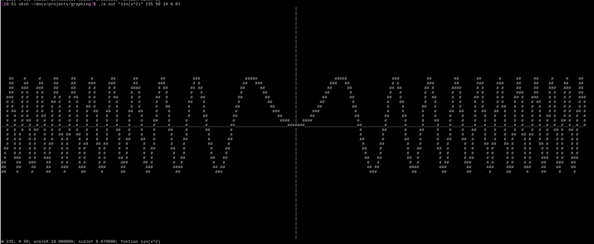

# Cli-Graphing
Graphing tool in the cli based on 2d arrays.

## Compiling
`gcc -lm main.c tinyexpr.c tinyexpr.h -o cligraph`
## How to use
```sh
./cligraph "(function)" (Width) (Height) (Scale Y) (Scale X)
``` 
Example:

```sh
./cligraph "sin(x)" 200 50 10 0.1
```
## TODO
-Create own expression parser
## libraries used
[TinyExpr by codeplea](https://github.com/codeplea/tinyexpr/tree/master)
