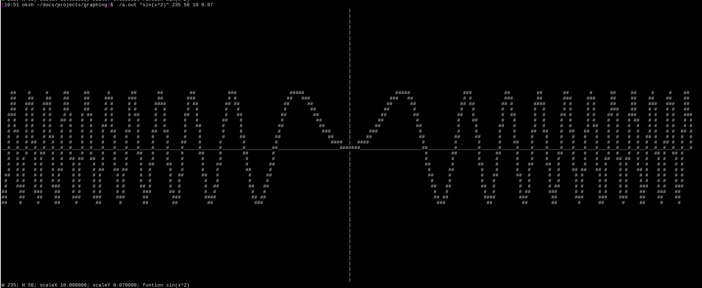

# Cli-Graphing
Graphing tool in the cli based on 2d arrays.

## How to use
`./cligraph "(function)" (Width) (Height) (Scale Y) (Scale X)`
example:
`./cligraph "sin(x)" 200 50 10 0.1`
##TODO
-Create own expression parser
## libraries used
[TinyExpr by codeplea](https://github.com/codeplea/tinyexpr/tree/master)
